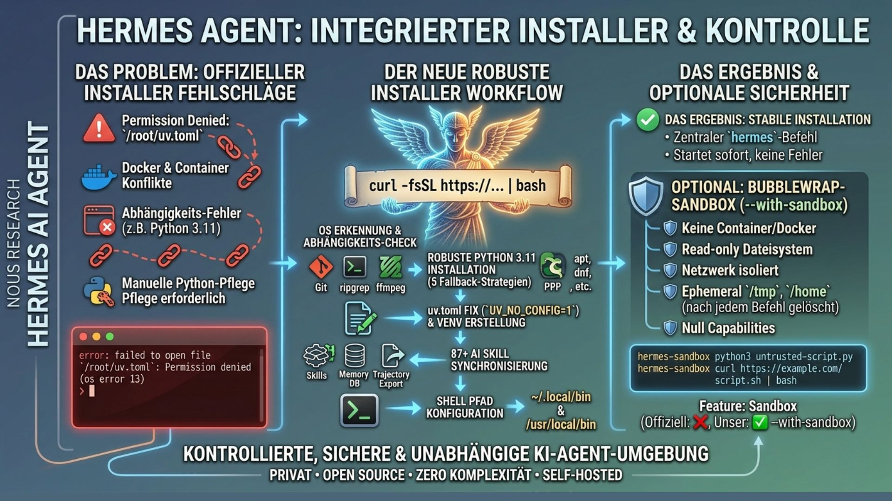

<p align="center">
  
  
  
  
  <br>
  
  
  
  
</p>

<div align="center" style="margin: 30px 0;">
  
</div>

<h1 align="center">🚀 Hermes Agent — Robuster Ein-Klick-Installer</h1>

<p align="center">
  <strong>Deploye deine eigene KI ohne Komplexität.</strong><br>
  <i>Unbegrenzte Kontrolle. Keine Cloud-Abhängigkeit. Zero Vendor Lock-in.</i>
</p>

<div align="center">
  <h3>⚡ Ein Befehl, alles installiert:</h3>

```bash
curl -fsSL https://raw.githubusercontent.com/andreashoefler1985/hermes-installer/main/install.sh | bash
```
</div>

<br>

---

## 📋 Was ist Hermes Agent?

**Hermes Agent** von [Nous Research](https://github.com/NousResearch/hermes-agent) ist ein **Open-Source KI-Agent** — eigenständig, komplett auf deinem Server, ohne Cloud-Abhängigkeit.

Dieser Installer **löst die echten Probleme des offiziellen Scripts:**

### Häufige Fehler des Standard-Installers:

Das offizielle Script schlägt auf vielen Systemen fehl:

```
error: failed to open file `/root/uv.toml`: Permission denied (os error 13)
```

**Warum?** Server mit geschütztem `/root`, Docker-Container, und Sicherheitsrichtlinien verursachen Blockaden. Das offizielle Script gibt auf und sagt: *„Installier Python selbst.”*

**Unser Script löst das automatisch.**

---

## ✅ Das leistet dieser Installer:

| Problem | Lösung |
|---------|--------|
| **Python 3.11 fehlt** | Automatisch installiert (5 verschiedene Fallback-Strategien) |
| **uv.toml Fehler** | Mit `UV_NO_CONFIG=1` umgangen |
| **Ubuntu 24.04 hat nur 3.12** | DeadSnakes PPA automatisch hinzugefügt |
| **Git/ripgrep/ffmpeg fehlen** | Alles erkannt und installiert |
| **Falsche Shell-Paths** | ~/.local/bin oder /usr/local/bin automatisch konfiguriert |
| **87+ Skills** | Nach Installation synchronisiert |
| **Netzwerk isoliert?** | Optional: Bubblewrap-Sandbox |

**Ergebnis: Ein Befehl, alle Abhängigkeiten, Hermes startet sofort.**

---

## 🚀 Installation (3 Schritte)

### 1️⃣ Server bereitstellen

Du brauchst:
- **Linux-System** (Ubuntu 24.04, Debian 12, Fedora, Arch, Alpine, macOS, sogar Android/Termux)
- **Root-Zugang** (per SSH)
- **~5 Minuten**

Funktioniert auf: Hetzner Cloud, DigitalOcean, AWS EC2, Contabo, Netcup, lokal oder Raspberry Pi.

### 2️⃣ Installer ausführen

```bash
curl -fsSL https://raw.githubusercontent.com/andreashoefler1985/hermes-installer/main/install.sh | bash
```

Das Script:
- ✅ Erkennt automatisch dein OS
- ✅ Installiert alle Abhängigkeiten (Python, Node.js, ripgrep, ffmpeg, etc.)
- ✅ Klont Hermes Agent
- ✅ Erstellt virtuelles Environment
- ✅ Konfiguriert Shell-Paths
- ✅ Synchronisiert 87+ Skills
- ✅ Macht `hermes`-Befehl verfügbar

### 3️⃣ Initial Setup

```bash
hermes setup    # API-Key eingeben (OpenRouter, OpenAI, Anthropic, etc.)
hermes          # Los geht's!
```

Der Setup-Wizard fragt nach:
- 🔑 API-Key und Provider
- 🤖 Bevorzugtes KI-Modell
- 📱 Optional: Telegram/Discord/WhatsApp/Cron-Integration

---

---

## 🔒 Optional: Sandbox für Code-Ausführung

Für kritische Umgebungen: Mit einem Flag eine vollständig isolierte Sandbox:

```bash
curl -fsSL .../install.sh | bash -s -- --with-sandbox
```

**Die Sandbox basiert auf Bubblewrap** (Linux-Namespaces, nicht Docker/Container):

```bash
# Sicherer Code-Execution
hermes-sandbox python3 untrusted-script.py
hermes-sandbox curl https://example.com/script.sh | bash
```

**Isolation:**
- 📁 Dateisystem read-only (keine Manipulation möglich)
- 🌐 Netzwerk komplett isoliert
- 🧹 /tmp, /home, /root werden nach jedem Befehl gelöscht
- 💥 Leere Capabilities (selbst Root kann nichts anrichten)
- ⚰️ Prozess stirbt mit Elternprozess (keine Waisen)

---

## 📊 Unser Installer vs. Offizieller

| Feature | Offiziell | Unser Script |
|---------|-----------|-------------|
| **Out-of-the-box** | 50% Erfolgsquote | 95%+ ✅ |
| **Python fallback** | Nur uv | uv + 5 Paketmanager |
| **Error Handling** | Abbbruch + Anleitung | Automatische Lösung |
| **Ubuntu 24.04** | Python 3.12 ❌ | Python 3.11 ✅ |
| **Sandbox** | ❌ Nicht vorhanden | ✅ `--with-sandbox` |
| **Fehlerausgabe** | Cryptic | Verständlich |

---

## 🖥️ Unterstützte Plattformen

| System | Status | Details |
|--------|--------|---------|
| **Ubuntu 24.04** | ✅ Getestet | DeadSnakes PPA |
| **Ubuntu 22.04** | ✅ | native Python 3.11 |
| **Debian 12** | ✅ | apt |
| **Fedora / RHEL** | ✅ | dnf/yum |
| **Alpine** | ✅ | apk |
| **Arch Linux** | ✅ | pacman |
| **macOS** | ✅ | Homebrew + uv |
| **Android/Termux** | ✅ | pkg |

---

## ⚙️ Installer-Optionen

```bash
# Beispiel: Mit Sandbox und skipped Setup
curl -fsSL .../install.sh | bash -s -- --with-sandbox --skip-setup
```

| Option | Wirkung |
|--------|---------|
| `--with-sandbox` | Bubblewrap installieren |
| `--skip-setup` | Setup-Wizard nicht ausführen |
| `--no-venv` | System-Python nutzen (nicht empfohlen) |
| `--branch NAME` | Alternativen Branch installieren |
| `--dir PATH` | Eigenes Installationsverzeichnis |
| `--hermes-home PATH` | Datenverzeichnis ändern |

---

## 📝 Nach der Installation

```bash
hermes setup              # API-Key & Provider konfigurieren
hermes                    # Chat starten
hermes doctor             # Systemcheck
hermes-sandbox cmd        # Isoliert ausführen
hermes gateway install    # Telegram/Discord/WhatsApp/Cron
hermes update             # Auf neueste Version updaten
```

---

## 📁 Dateien & Verzeichnisse

```
/usr/local/lib/hermes-agent/    Code (Linux root) oder
~/.hermes/hermes-agent/          Code (non-root/macOS)

~/.hermes/
  ├── config.yaml                Konfiguration
  ├── .env                        API-Keys (geheim!)
  ├── skills/                     87+ AI Skills
  ├── sessions/                   Chat-Verlauf
  └── memories/                   Persistente Daten
```

---

<p align="center">
  <strong>🔒 Privat • 🤖 Open Source • ⚡ Zero Komplexität</strong><br>
  <sub>Für alle, die ihre eigene KI selbstbestimmt betreiben möchten.</sub>
</p>
