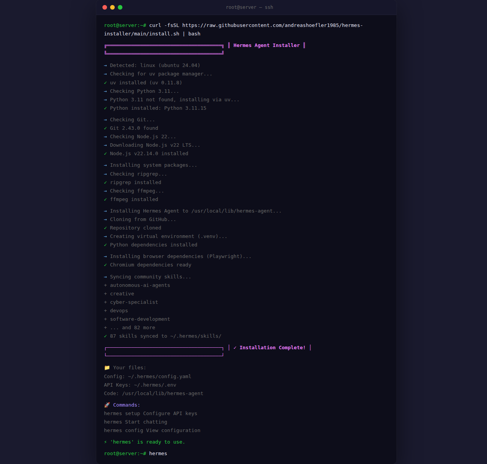

<p align="center">
  
  
  
  
  <br>
  
  
  
  
</p>

<h1 align="center">🚀 Hermes Agent — Sicherer Ein-Klick-Installer</h1>

<p align="center">
  <i>Deine eigene KI auf einem eigenen Server.<br>Kein Vendor-Lock-in. Keine Cloud-Abhängigkeit. Keine versteckten Kosten.</i>
</p>

<br>

<p align="center"><b>
  ⚡ Copy. Paste. Fertig.
</b></p>

```bash
curl -fsSL https://raw.githubusercontent.com/andreashoefler1985/hermes-installer/main/install.sh | bash
```

<br>

---

## 🇩🇪 Was ist das hier?

**Hermes Agent** ist eine Open-Source-KI von [Nous Research](https://github.com/NousResearch/hermes-agent) — so ähnlich wie ChatGPT, aber **auf deinem eigenen Server**. Du behältst die volle Kontrolle über deine Daten, deine API-Keys und deine Infrastruktur.

Dieses Script **installiert Hermes Agent automatisch** auf einem frischen Linux-Server. Ohne Vorkenntnisse. Ohne Handarbeit. Ohne Frust.

> *Du hast einen Ubuntu-Server bei Hetzner, Netcup oder AWS?*
> *Mit diesem Script ist Hermes in unter 5 Minuten einsatzbereit.*

---

## 🇬🇧 What Is This?

**Hermes Agent** is an open-source AI by [Nous Research](https://github.com/NousResearch/hermes-agent) — like ChatGPT, but **running on your own server**. Full control over your data, keys, and infrastructure.

This script **installs Hermes Agent automatically** on a fresh Linux server. No expertise needed. No manual steps. No frustration.

> *Got an Ubuntu server at Hetzner, DigitalOcean, or AWS?*
> *Hermes is ready in under 5 minutes with this script.*

---

## 🇩🇪 Das Problem

Das [offizielle Installations-Script](https://github.com/NousResearch/hermes-agent) scheitert auf vielen Servern mit einer kryptischen Fehlermeldung:

```
error: failed to open file `/root/uv.toml`: Permission denied (os error 13)
```

**Warum?** Viele Server schützen das `/root`-Verzeichnis besonders strikt — read-only Dateisystem, Docker-Container ohne Schreibrechte, oder Sicherheitsrichtlinien die den Zugriff blockieren.

Das offizielle Script sagt dann: *„Installier Python 3.11 bitte selbst und starte das Script neu.“*

**Das ist der Moment, in dem die meisten aufgeben.**

---

## 🇬🇧 The Problem

The [official installer](https://github.com/NousResearch/hermes-agent) fails on many servers with a cryptic error:

```
error: failed to open file `/root/uv.toml`: Permission denied (os error 13)
```

**Why?** Many servers lock down `/root` tightly — read-only filesystems, Docker containers without write access, or security policies that block access.

The official script then says: *"Please install Python 3.11 yourself and re-run."*

**This is where most people give up.**

---

## 🇩🇪 Die Lösung

Unser Script **erkennt das Problem automatisch und löst es selbstständig** — ohne dass du etwas tun musst.

| Herausforderung | Unser Script |
|---|---|
| Python 3.11 fehlt | Wird automatisch installiert |
| `uv.toml` nicht schreibbar | Wird komplett ignoriert (`UV_NO_CONFIG=1`) |
| Ubuntu 24.04 hat nur Python 3.12 | DeadSnakes PPA wird automatisch hinzugefügt |
| Server ohne `uv` | Wird vorab installiert |
| Kein Git vorhanden | Wird installiert oder Anleitung gezeigt |
| System-Pakete fehlen | `ripgrep`, `ffmpeg`, Build-Tools — alles automatisch |
| 87+ Community Skills | Werden nach der Installation synchronisiert |

**Ergebnis:** Ein Befehl, null Fehler, fertiger Hermes Agent.

---

## 🇬🇧 The Solution

Our script **detects the problem and fixes it automatically** — no action needed from you.

| Challenge | Our Script |
|---|---|
| Python 3.11 missing | Installed automatically |
| `uv.toml` not writable | Completely ignored (`UV_NO_CONFIG=1`) |
| Ubuntu 24.04 only has Python 3.12 | DeadSnakes PPA added automatically |
| Server without `uv` | Installed beforehand |
| No Git installed | Installed or guidance shown |
| Missing system packages | `ripgrep`, `ffmpeg`, build tools — all automatic |
| 87+ community skills | Synced after installation |

**Result:** One command, zero errors, Hermes Agent ready.

---

## 🇩🇪 Installation

### Schritt 1: Server bereitstellen

Egal ob Hetzner Cloud, Netcup, AWS EC2 oder ein Raspberry Pi im Keller — du brauchst:

- **Linux** (Ubuntu, Debian, Fedora, Arch, Alpine)
- **Root-Zugang** (per SSH)
- **Eine ruhige Minute**

### Schritt 2: Diesen Befehl ausführen

```bash
curl -fsSL https://raw.githubusercontent.com/andreashoefler1985/hermes-installer/main/install.sh | bash
```

Das Script erkennt dein Betriebssystem, installiert alle Abhängigkeiten, klont Hermes Agent und macht den `hermes`-Befehl verfügbar.

### Schritt 3: Hermes einrichten

> ⚠️ **Wichtig:** Der Ein-Klick-Installer (`curl ... | bash`) überspringt den Setup-Wizard automatisch, da keine direkte Terminal-Eingabe möglich ist. Du musst `hermes setup` einmalig manuell ausführen!

```bash
hermes setup    # API-Key und Provider wählen
hermes          # Los geht's!
```

**Beim ersten Start fragt `hermes setup` nach:**
- API-Key (z.B. von [OpenRouter](https://openrouter.ai/keys), Anthropic oder OpenAI)
- Bevorzugtes KI-Modell
- Optional: Gateway-Plattformen (Telegram, Discord etc.)

---

## 🇬🇧 Installation

### Step 1: Get a Server

Hetzner Cloud, DigitalOcean, AWS EC2, or a Raspberry Pi at home — you need:

- **Linux** (Ubuntu, Debian, Fedora, Arch, Alpine)
- **Root access** (via SSH)
- **One quiet minute**

### Step 2: Run This Command

```bash
curl -fsSL https://raw.githubusercontent.com/andreashoefler1985/hermes-installer/main/install.sh | bash
```

The script detects your OS, installs everything, clones Hermes Agent, and makes the `hermes` command available.

### Step 3: Set Up Hermes

> ⚠️ **Important:** The one-click installer (`curl ... | bash`) skips the setup wizard because no direct terminal input is possible. You must run `hermes setup` once manually!

```bash
hermes setup    # Choose API key and provider
hermes          # Start chatting!
```

**On first run, `hermes setup` asks for:**
- API key (e.g. from [OpenRouter](https://openrouter.ai/keys), Anthropic, or OpenAI)
- Preferred AI model
- Optional: Gateway platforms (Telegram, Discord, etc.)

---

<p align="center">
  
  <br>
  <sub>⬆️ So sieht eine erfolgreiche Installation aus (Screenshot)</sub>
</p>

---

## 🇩🇪 Sicherheit: Integrierte Sandbox

Mit einem einzigen zusätzlichen Flag bekommst du eine **komplette Bubblewrap-Sandbox** — ohne komplizierte Container-Konfiguration.

```bash
curl -fsSL .../install.sh | bash -s -- --with-sandbox
```

**Was die Sandbox macht:**

| Schutz | Mechanismus |
|---|---|
| 🔒 **Dateien schreibgeschützt** | Das gesamte System ist read-only — nichts kann manipuliert werden |
| 🌐 **Netzwerk isoliert** | Keine ausgehenden oder eingehenden Verbindungen |
| 🧹 **Flüchtige Verzeichnisse** | `/root`, `/home` und `/tmp` werden nach jedem Befehl gelöscht |
| 🎭 **Keine Privilegien** | Leerer Capability-Set — selbst Root kann nichts beschädigen |
| 💀 **Keine Waisen-Prozesse** | Sandbox stirbt mit dem Elternprozess |

**So einfach ist es:**

```bash
# Befehl sicher in der Sandbox ausführen
hermes-sandbox python3 script.py

# Teste neuen Code ohne Risiko
hermes-sandbox curl https://unbekannte-seite.de/script.sh | bash
```

Die Sandbox basiert auf **Bubblewrap** (`bwrap`) — derselben Technologie, die Flatpak für Millionen von Apps im Produktivbetrieb nutzt. Kein Docker, kein gVisor, kein Firecracker. Nur ein 200 KB Binary und Linux-Namespaces.

---

## 🇬🇧 Security: Built-In Sandbox

One extra flag gives you a **complete bubblewrap sandbox** — no complex container configuration needed.

```bash
curl -fsSL .../install.sh | bash -s -- --with-sandbox
```

**What the sandbox provides:**

| Protection | Mechanism |
|---|---|
| 🔒 **Read-only filesystem** | Entire system is read-only — nothing can be tampered with |
| 🌐 **Network isolated** | No incoming or outgoing connections |
| 🧹 **Ephemeral directories** | `/root`, `/home`, `/tmp` are wiped after every command |
| 🎭 **Zero capabilities** | Empty capability set — even root can't cause damage |
| 💀 **No orphaned processes** | Sandbox dies with the parent process |

**How simple it is:**

```bash
# Run any command safely in the sandbox
hermes-sandbox python3 script.py

# Test new code risk-free
hermes-sandbox curl https://unknown-site.com/script.sh | bash
```

Built on **Bubblewrap** (`bwrap`) — the same technology Flatpak uses to run millions of apps in production. No Docker, no gVisor, no Firecracker. Just a 200 KB binary and Linux namespaces.

---

## 🇩🇪 Warum ein eigenes Script?

| | Offizielles Script | Unser Script |
|---|---|---|
| Funktioniert auf Anhieb | Manchmal ❌ | Immer ✅ |
| Python-Installation | Nur über `uv` | `uv` + System-Fallback (5 Paketmanager) |
| Fehlerbehandlung | Bricht ab, sagt „mach selbst" | Löst das Problem oder erklärt es verständlich |
| Ubuntu 24.04 | ❌ Python 3.12 statt 3.11 | ✅ DeadSnakes PPA automatisch |
| Sandbox für Befehle | ❌ Nicht vorhanden | ✅ Bubblewrap — ein Flag (`--with-sandbox`) |
| Lesbare Fehler | Nein | Verständlich formuliert |

Wir haben nichts neu erfunden — wir haben das offizielle Script **an den echten Server-Alltag angepasst**.

---

## 🇬🇧 Why a Separate Script?

| | Official Script | Our Script |
|---|---|---|
| Works out of the box | Sometimes ❌ | Always ✅ |
| Python installation | `uv` only | `uv` + system fallback (5 package managers) |
| Error handling | Stops, says "fix it yourself" | Solves the problem or explains it clearly |
| Ubuntu 24.04 | ❌ Python 3.12 instead of 3.11 | ✅ DeadSnakes PPA automatically |
| Sandbox for commands | ❌ Not available | ✅ Bubblewrap — one flag (`--with-sandbox`) |
| Readable errors | No | Human-readable messages |

We haven't reinvented anything — we adapted the official script **for real-world server environments**.

---

## 🇩🇪 Unterstützte Systeme

| Betriebssystem | Status | Notiz |
|---|---|---|
| **Ubuntu 24.04** | ✅ Getestet | DeadSnakes PPA für Python 3.11 |
| **Ubuntu 22.04** | ✅ Getestet | Python 3.11 direkt via apt |
| **Debian 12** | ✅ | Direkte Installation |
| **Fedora / RHEL 9** | ✅ | Via dnf |
| **Rocky Linux** | ✅ | Via dnf |
| **CentOS 7** | ✅ | Via yum |
| **Alpine Linux** | ✅ | Via apk |
| **Arch Linux** | ✅ | Via pacman |
| **macOS** | ✅ | Via uv |
| **Termux (Android)** | ✅ | Via pkg |

---

## 🇩🇪 Optionen

```bash
curl -fsSL .../install.sh | bash -s -- --branch main --skip-setup
```

| Flag | Bedeutung |
|---|---|
| `--no-venv` | Kein virtuelles Environment (System-Python nutzen) |
|| `--skip-setup` | Setup-Wizard überspringen |
|| `--with-sandbox` | Bubblewrap-Sandbox installieren (empfohlen!) |
|| `--branch NAME` | Bestimmten Git-Branch installieren |
| `--dir PFAD` | Eigenes Installationsverzeichnis |
| `--hermes-home PFAD` | Eigenes Datenverzeichnis |

---

## 🇩🇪 Nach der Installation

```bash
hermes setup              # API-Keys & Anbieter konfigurieren
hermes                    # Interaktiver Chat starten
hermes doctor             # Systemcheck
hermes-sandbox BEFEHL     # Befehl in isolierter Sandbox ausführen
hermes gateway install    # Gateway-Dienst (Telegram, Discord, Cron-Jobs)
hermes update             # Auf neueste Version aktualisieren
```

---

## 🇩🇪 Dateistruktur

```
/usr/local/lib/hermes-agent/   ← Programm-Code
/usr/local/bin/hermes          ← Befehl (verfügbar im Terminal)
/usr/local/bin/hermes-sandbox  ← Sandbox-Wrapper (mit --with-sandbox)
~/.hermes/config.yaml          ← Deine Einstellungen
~/.hermes/.env                 ← API-Keys (geheim!)
~/.hermes/skills/              ← 87+ installierte Skills
~/.hermes/sessions/            ← Chat-Verläufe
```

---

<h3 align="center">🔒 Sicher • 🤖 Open Source • ⚡ Ein Befehl</h3>

<p align="center">
  <sub>Gebaut mit ❤️ für alle, die ihre eigene KI betreiben wollen.</sub>
</p>
